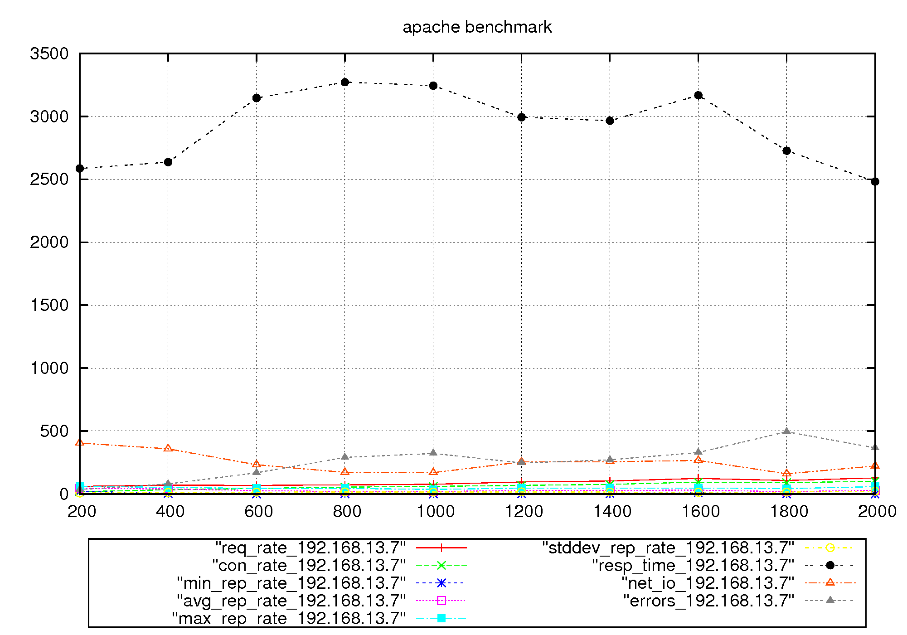
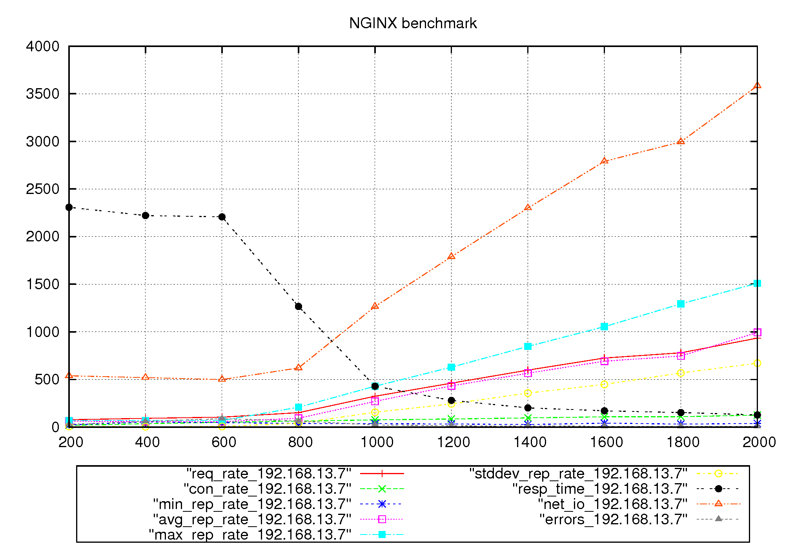
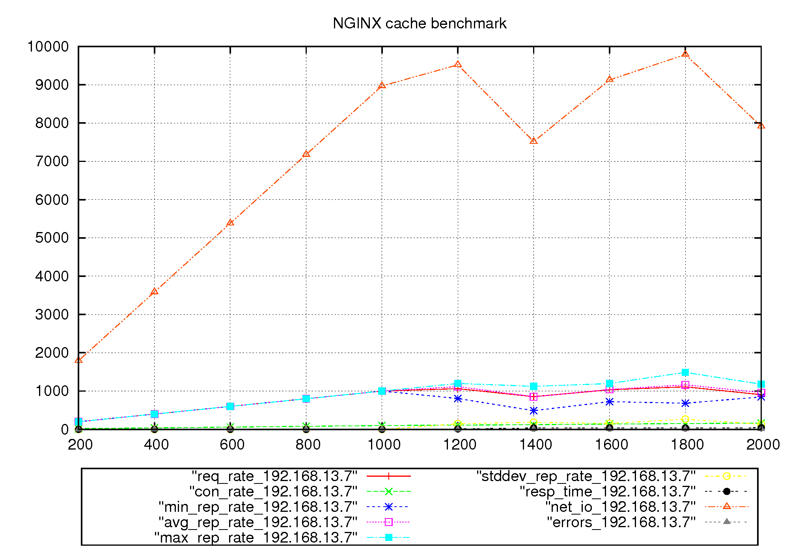

Running Wordpress-fpm with docker-compose
==============================================

This guide describe how to build a running Wordpress-fpm+MySQl with docker-compose. First of all copy all this directory in another location. You will modify configuration files  to develop your application. Next, rename the whole directory with your project name. Since docker-compose will build images starting from `docker-compose.yml` directory, it will be easier to find your builded images. In this example, the
wordrpress site is referred as `blog`, as stated by installing wordpress guide. There are some directory that will be mounted as data volume: this will make easier to develop the code or re-spawn the docker application on another location using the same volume directory (as it would be for mysql-data directory). For this model, there will be a `php-data` directory for wordpress directory, and a `mysql-data` directory for mysql
data files

## The docker-compose.yml file

Before to start take a look in the `docker-compose.yml` file. This is the configuration file used by `docker-compose` commands. All `docker-compose` commands need to be instantiated in this directory or by specifing the path of `docker-compose.yml` file, as stated by the [docker compose documentation](https://docs.docker.com/compose/). For such compose project, 4 countainers will be instantiated:

1. `db`: in this container will be placed the mysql 5.6 server. This container will be listen for `php` wordpress container
2. `php`: in this container there will be the phpmyadmin served by php-fpm server. This container will be linked with `db` container
3. `nginx`: this container will have nginx installed. All static files will be served by nginx by sharing static content as docker volumes between containers. php files will be served by the `php` container via php-fpm plugin.

Those name will be placed in each container in the `/etc/hosts` files, so you can ping `php` host inside `nginx` container, for instance, mo matter what ip addresses will be given to the container by docker. When starting a project for the first time, data directory and inital configuration have to be defined. Data directories will be placed inside this directory, in order to facilitate `docker-compose` commands once docker images where configured for the application. When data directories are created for the first time, the ownership of such directories is the same of the service running in the container. You can change it as you prefer, but remember that service run under a *non privileged* user, so you have to define **at least** the *read* privileged for files, and the *read-execute* privileges for directories.

## Enabling permalink

In order to enhable permalink, you have to seto properly the try_files directive in `nginx/conf.d/default.conf`

```
# the default location. Rewrite location to point a index file
location / {
    # try files or directory. If it doesn’t find a directory or a file,
    # it performs an internal redirect to /index.php passing the query
    # string arguments as parameters.
    # http://www.lowendguide.com/3/webservers/wordpress-permalinks-with-nginx/
    try_files $uri $uri/ /blog/index.php?$args;
}

```

The last directive of try_files MUST prepend the wordpress installation directory (`blog` in such case or wharever you want) as described [here](http://www.lowendguide.com/3/webservers/wordpress-permalinks-with-nginx/). This directive can be modified even after containers were built, since this configuration file is provided by HOST as a volume. If you want to change this directive once containers are builded, simply restart NGINX container:

```bash
$ docker-compose restart nginx
```

## Start a project for the first time

Before building and instantiating containers, you need to modify the `MYSQL_ROOT_PASSWORD` and `PROJECT_NAME` variables according your needs. Then you can build and run containers by typing:

```bash
$ docker-compose up -d
```
inside project directory. Images will be build and instantiated in background. See [docker compose documentation](https://docs.docker.com/compose/) for more details.

## Starting and stopping containers

To stop and restart containers, user docker-compose commands like:

```bash
$ docker-compose start
$ docker-compose restart
$ docker-compose stop
```

Those commands wouldn't recreate containers. Note that using `docker-compose up` will destroy containers (all data outside volume directories will be recreated)

### Dumping data from database

With the docker run command, you can do a `mysite` database dump:

```bash
$ docker run -it --link <mysql_running_container>:mysql -v $PWD:/data/ -e MYSQL_ROOT_PASSWORD="my-secret-pw" \
    --rm mysql:5.6 sh -c 'exec mysqldump -h"$MYSQL_PORT_3306_TCP_ADDR" -P"$MYSQL_PORT_3306_TCP_PORT" \
    -uroot -p"$MYSQL_ENV_MYSQL_ROOT_PASSWORD" wordpress > /data/wordpress_dump.sql'
```

Note as variables like `MYSQL_ROOT_PASSWORD="my-secret-pw"` are traslated with a prefix `MYSQL_ENV_` inside running container. Since in this example the default password is `my-secret-pw` you may not specify this environment variable inside the running container or by passing the `-e VARIABLE=VALUE` syntax. The dump will be write in the `/data` volumes directory, which is your current `$PWD` directory. The ownership of dump file is the same of the `$USER` in the running container.

### Loading data in database

With the docker run command, you can import a `<file>.sql' file by adding its path as a docker volume, for instance, if you are in `mysite_dump.sql` directory:

```bash
$ docker run -it --link <mysql_running_container>:mysql -v $PWD:/data/ -e MYSQL_ROOT_PASSWORD="my-secret-pw" \
    --rm mysql:5.6 sh -c 'exec mysql -h"$MYSQL_PORT_3306_TCP_ADDR" -P"$MYSQL_PORT_3306_TCP_PORT" \
    -uroot -p"$MYSQL_ENV_MYSQL_ROOT_PASSWORD" wordpress < /data/wordpress_dump.sql'
```

## Enabling cache purging

The nginx container mounts a particoular version of nginx compiled by [rtcamp][1]. This version of NGINX mount the fastcgi_cache_purge module which can be controlled by [Nginx Helper][2] plugin by enabling some configurationin nginx, as described [here][1]. To ensure that cache purgin module is installed, enter the NGINX container and type:

```bash
nginx -V 2>&1 | grep nginx-cache-purge -o
```
If you see nginx-cache-purge in output then you already have it. Then you should verify that you have the purge location in your nginx configuration file, with the appropriate FastCGI namespace: and key (this is already configured in such project)

```
location ~ /purge(/.*) {
    fastcgi_cache_purge fastcgicache "$scheme$request_method$host$1";
}
```

Then you have to install the [Nginx Helper][2] plugin. Then configure the module for purging cache using NGINX.


The NGINX cache configuration will write file in /dev/run location, and will write cache only for static files (no cache will be written for POST request or wp-admin location, for example). See NGINX configuration files and [fastcgi_cache with conditional purging][1] for more details. To ensure that cache is working properly, you may see something like this:

```bash
$ curl -X GET -I http://localhost/blog/
HTTP/1.1 200 OK
Server: nginx/1.6.3
Date: Fri, 16 Oct 2015 09:01:05 GMT
Content-Type: text/html; charset=UTF-8
Transfer-Encoding: chunked
Connection: keep-alive
Vary: Accept-Encoding
X-Powered-By: PHP/5.6.14
X-Pingback: http://192.168.13.7/blog/xmlrpc.php
X-Cache: MISS

$ curl -X GET -I http://localhost/blog/
HTTP/1.1 200 OK
Server: nginx/1.6.3
Date: Fri, 16 Oct 2015 09:01:07 GMT
Content-Type: text/html; charset=UTF-8
Transfer-Encoding: chunked
Connection: keep-alive
Vary: Accept-Encoding
X-Powered-By: PHP/5.6.14
X-Pingback: http://192.168.13.7/blog/xmlrpc.php
X-Cache: HIT

$ curl -X GET -I http://localhost/blog/wp-admin/
HTTP/1.1 302 Moved Temporarily
Server: nginx/1.6.3
Date: Fri, 16 Oct 2015 09:02:37 GMT
Content-Type: text/html; charset=UTF-8
Transfer-Encoding: chunked
Connection: keep-alive
X-Powered-By: PHP/5.6.14
Expires: Wed, 11 Jan 1984 05:00:00 GMT
Cache-Control: no-cache, must-revalidate, max-age=0
Pragma: no-cache
Location: http://192.168.13.7/blog/wp-login.php?redirect_to=http%3A%2F%2Flocalhost%2Fblog%2Fwp-admin%2F&reauth=1
X-Cache: BYPASS
```

More references can be found here:

1. [How to Configure Nginx FASTCGI Cache](http://www.nginxtips.com/configure-nginx-fastcgi-cache/)
2. [Nginx Caching](https://serversforhackers.com/nginx-caching/)
3. [How to Setup FastCGI Caching with Nginx on your VPS](https://www.digitalocean.com/community/tutorials/how-to-setup-fastcgi-caching-with-nginx-on-your-vps)
4. [Understanding Nginx HTTP Proxying, Load Balancing, Buffering, and Caching](https://www.digitalocean.com/community/tutorials/understanding-nginx-http-proxying-load-balancing-buffering-and-caching)
5. [Using Nginx as a reverse caching proxy for Wordpress: the setup](https://www.djm.org.uk/wordpress-nginx-reverse-proxy-caching-setup/)
6 [Nginx FastCGI cache](https://gist.github.com/magnetikonline/10450786#nginx-fastcgi-cache)

[1]: https://rtcamp.com/tutorials/linux/ubuntu-php-mysql-nginx-postfix/#installing-nginx "Installing NGINX"
[2]:https://wordpress.org/plugins/nginx-helper/

## Serving docker containers in docker HOST

You can serve docker compose using HOST NGINX, for instance, via proxy_pass. Place the following code inside NGINX server environment. Remember to specify the port exported by your docker NGINX instance:

```
location /blog/ {
    # Add info to webpages
    proxy_set_header Host $host;
    proxy_set_header X-Real-IP $remote_addr;
    proxy_set_header X-Forwarded-Host $host;
    proxy_set_header X-Forwarded-Server $host;
    proxy_set_header X-Forwarded-For $proxy_add_x_forwarded_for;
    proxy_pass_header Set-Cookie;

    # Subitting a request to docker service
    proxy_pass http://localhost:10080/blog/;
    proxy_redirect http://$host:10080/ $scheme://$http_host/;
}
```

## Benchmarking

Here are some benchmarkings using the default wordpress installation obtained by running [Autobench](http://www.xenoclast.org/autobench/) on wordpress `index.php`

### Apache benchmarking

This benchmark was run with [Autobench](http://www.xenoclast.org/autobench/) using the following composed image running on Apache wordpress:

```yaml
wordpress:
  image: wordpress
  links:
    - db:mysql
  ports:
    - 8080:80

db:
  image: mysql:5.6
  environment:
    MYSQL_ROOT_PASSWORD: my-secret-pw
```

The [ServerLimit](https://httpd.apache.org/docs/2.2/mod/worker.html) directive in apache was forced to 16, in order to avoid load average greater than 16. Hare values and graphs obtained with [Autobench](http://www.xenoclast.org/autobench/)

|dem_req_rate|req_rate|con_rate|min_rep_rate|avg_rep_rate|max_rep_rate|stddev_rep_rate|resp_time|net_io|errors|
|----|----|----|----|----|----|----|----|----|----|
|200|60.0|18.1|21.2|44.4|60.4|6.7|2585.4|403.7|35.2345154436999|
|400|70.3|32.7|3.8|39.9|52.2|10.7|2635.5|357.9|79.3523618761476|
|600|67.7|43.8|0.0|25.9|44.4|14.1|3144.4|231.9|168.298611111111|
|800|71.8|54.1|0.0|18.9|44.4|15.6|3271.5|171.0|289.671361502347|
|1000|76.9|59.6|0.0|19.0|36.4|15.1|3243.5|169.3|322.462344466274|
|1200|95.1|68.5|1.0|28.4|46.0|15.8|2992.7|253.9|246.157684630739|
|1400|102.7|76.2|1.2|27.9|47.0|15.4|2965.2|256.2|271.420704845815|
|1600|122.6|94.3|8.8|30.3|47.0|12.7|3167.0|265.6|329.458388375165|
|1800|107.5|89.7|0.0|18.3|42.2|15.3|2726.8|159.7|494.350842418236|
|2000|126.6|100.0|0.0|28.6|58.2|21.6|2481.6|222.3|366.567828020756|



The apache benchmark is linear becaues only a small amount of connection will be processed by apache-mpm

### NGINX-phpfpm benchmark

This is a benchmark obtained by this composed project *without* NGINX FastCGI cache and using 16 php-fpm worker (like the apache benchmark, load average is ~ 16)

|dem_req_rate|req_rate|con_rate|min_rep_rate|avg_rep_rate|max_rep_rate|stddev_rep_rate|resp_time|net_io|errors|
|----|----|----|----|----|----|----|----|----|----|
|200|77.1|18.8|21.2|60.1|69.6|6.3|2308.5|538.2|28.2944524360498|
|400|92.0|35.4|53.8|57.7|69.4|3.7|2221.3|518.8|59.0925767396356|
|600|104.1|49.8|46.4|55.5|68.8|5.6|2207.5|498.4|87.7517985611511|
|800|150.4|62.4|38.0|92.1|208.0|39.5|1267.0|621.3|63.3468834688347|
|1000|323.4|75.6|35.0|269.4|428.4|155.3|428.8|1265.2|21.6308427157967|
|1200|460.4|84.6|32.0|431.7|628.6|243.7|280.4|1789.3|13.3580473175608|
|1400|598.4|95.9|26.4|565.8|847.1|357.1|200.9|2299.8|9.77060023925128|
|1600|724.3|107.5|40.6|691.7|1053.5|447.9|170.9|2790.3|7.82656034841643|
|1800|779.1|108.7|30.8|746.0|1294.3|568.2|151.7|2994.8|6.58817933166845|
|2000|934.1|126.0|38.0|993.4|1509.9|671.1|127.4|3583.5|5.75315896060926|



When number of request increases, nginx can't server all incoming messages, since it waits for php-fpm results. We notice a decrease in respose time since nginx reply with a *301 moved permanently* instead of *200 success*. Maybe this can be a misconfiguration on NGINX server.

### NGINX-phpfpm with FastCGI Cache benchmark

This is a benchmark obtained by this composed project *with* NGINX FastCGI cache and using 16 php-fpm worker (but load average is still < 1)

|dem_req_rate|req_rate|con_rate|min_rep_rate|avg_rep_rate|max_rep_rate|stddev_rep_rate|resp_time|net_io|errors|
|----|----|----|----|----|----|----|----|----|----|
|200|200.0|20.0|200.0|200.0|200.0|0.0|0.7|1794.0|0|
|400|400.1|40.0|400.0|400.0|400.0|0.0|0.7|3588.0|0|
|600|600.1|60.0|600.0|600.0|600.0|0.0|0.7|5381.8|0|
|800|800.0|80.0|799.9|800.0|800.3|0.1|0.7|7175.4|0|
|1000|1000.0|100.0|999.7|1000.0|1000.1|0.1|0.7|8968.9|0|
|1200|1063.6|112.0|804.9|1118.2|1200.3|144.8|12.7|9521.0|0.633165192798801|
|1400|853.6|122.8|488.2|851.9|1123.3|186.8|35.8|7513.5|5.43679070994985|
|1600|1034.5|139.3|722.5|1042.8|1198.1|154.4|39.0|9126.1|4.44584451870925|
|1800|1110.7|152.8|683.1|1162.7|1487.9|265.0|36.7|9787.3|4.81205534703938|
|2000|905.8|166.7|849.1|959.6|1180.9|133.1|42.9|7911.9|10.0941363275491|



Using NGINX with caching, requests cales linearly until 1000 connections. This limit seems to be related to [docker-proxy performances](https://github.com/docker/docker/issues/7857). We will furter investigate.
